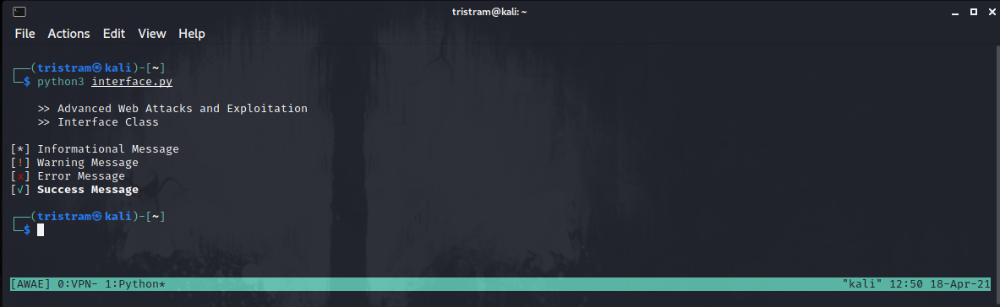
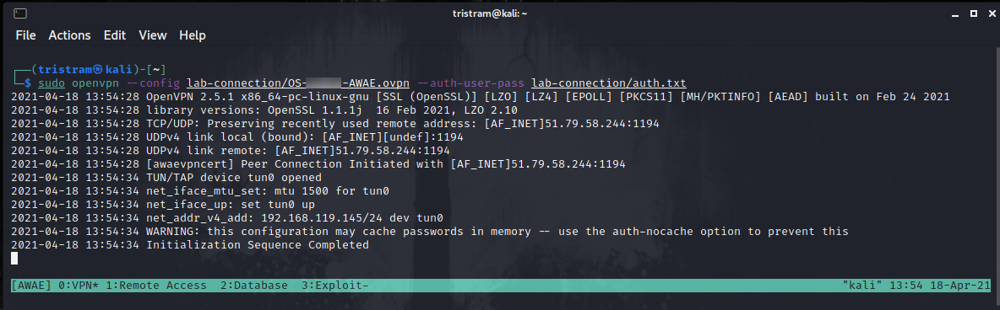
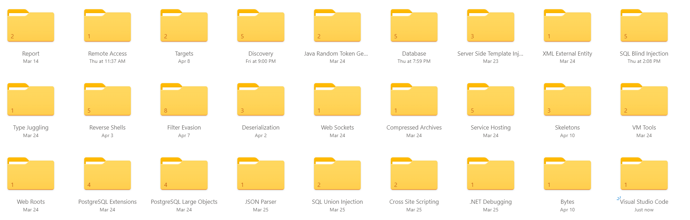

# Crawling through the webs


Whether your focus is driven to offensive or defensive security, it eventually becomes a team effort and I strongly believe that knowledge sharing will make your team stronger. Offensive Security is part of that team and their trainings empower students and professionals all over the world. Thankfully, they have helped empower me through a successful journey to achieve my OSWE certification!

For myself, my focus has always been on the blue side of things defending Healthcare. However, what better way is there to learn how to defend your network then to learn how to find and exploit vulnerabilities yourself? Within this critical infrastructure, web applications are becoming more and more dominant which was the beacon to pull me into the course. 

Once my course started, I skimmed through the PDF quick and said to myself "what did I just get myself into?". I felt like a fly caught in a spider web. However, once I finished the course, I became the spider crawling through the webs to catch the fly.

### Boots on the Ground
---
1. Prerequisites
2. Mindset
3. Community
4. Course + Lab
5. Stay Organized
6. Practice Machines
7. Before the exam
8. During the exam
9. Putting it all together

### 1. Prerequisites
---
I came into this course without having any web application development experience. What was likely a big help for me was prior to my current focus on a blue team I specialized in infrastructure automation which gave me an edge with reading / writing scripts and following code execution. During that time, I also spent a little time with SQL report writing so working in databases was not much of an issue for me.

The course recommends that you are comfortable with reading/writing code in a least one language but be prepared as most of the proof-of-concept code is written in Python. Because of this, it would be in your best interest to use Python as well. If you are not too comfortable with using Python, I recommend you practice a little bit with the following:

1. Create a function that takes in a string such as 'offensive-security.com' and outputs a modified value such as 'https://www.offensive-security.com/'
2. Performing a HTTP GET with the requests module. You can host your own web server on kali using apache or `sudo python3 -m http.server 80`
3. Performing a HTTP POST with the requests module. (https://github.com/tjnull/OSCP-Stuff/blob/master/Transferring-Files/HTTPServerWithUpload.py)
4. Logging into a web application and performing authenticated web requests using session objects
5. Using regex to extract information from strings or http response bodies (https://docs.python.org/3/howto/regex.html / https://regex101.com/)
6. How to encode/decode base64 data (https://docs.python.org/3/library/base64.html)
7. How to use `argparse` to incorporate input parameters into your scripts (https://docs.python.org/3/library/argparse.html)
8. Understand why URL encoding is important and how to do it for all characters and/or unsafe characters in a URL when applicable
```python
def url_encode_all(url):
    return "".join("%{0:0>2}".format(format(ord(char), "x")) for char in url)

def url_encode_unsafe(url):
    return urllib.parse.quote(url, safe='')
```

If you can comfortably do the above, then you are going to be just fine. However, you are going to learn very quickly that you need to be consistent with your scripts. For example, try to personalize your scripts a little bit. One option I would recommend is a fun way to print status messages. Personally, I think using just regular print statements are boring, so I created the below interface class to make it more fun and help me be more consistent. Have fun with it!

```Python
#!/usr/bin/python3

# Simple interface class
class Interface ():
    def __init__ (self):
        self.red = '\033[91m'
        self.green = '\033[92m'
        self.white = '\033[37m'
        self.yellow = '\033[93m'
        self.bold = '\033[1m'
        self.end = '\033[0m'

    def header(self):
        print('\n    >> Advanced Web Attacks and Exploitation')
        print('    >> Interface Class\n')

    def info (self, message):
        print(f"[{self.white}*{self.end}] {message}")

    def warning (self, message):
        print(f"[{self.yellow}!{self.end}] {message}")

    def error (self, message):
        print(f"[{self.red}x{self.end}] {message}")

    def success (self, message):
        print(f"[{self.green}✓{self.end}] {self.bold}{message}{self.end}")

# Instantiate our interface class
global output
output = Interface()

# Output examples
output.header()
output.info('Informational Message')
output.warning('Warning Message')
output.error('Error Message')
output.success('Success Message')
```



### 2. Mindset
---
One of the common fears that I have read about this course is that you are dumped into a pool of code and you must find the flaw in the 1s and 0s in source code. This is not the case at all and is something that I have wanted to share with folks. Yes, this course does require you to review source code, but it is not that extreme. Let me change the perspective a bit:

During a black box test, you may find yourself hacking away until you find that one condition that works in your favor, but where the white box approach comes in is you do not have to hack away aimlessly. If you find an interesting feature, such as a file upload feature, you use your source code access to review the function that drives that feature to see if there is a way you can exploit it. While you can assess the source code alone, it's not the only approach you could take.

When you are assessing source code, the course provides you the guidance on how you can build a methodology to search for those vulnerable conditions and what you should be focusing on. I feel some students expect this course to provide you an ordered list of things to do with every web application, but that is not the case nor do I feel that is a good thing either. They provide you enough to feel inspired to expand beyond the course.

### 3. Community
---
When you start to take any course, especially those at the caliber of Offensive Security, you may run into scenarios that you are not familiar with or do not quite understand and it can become quite frustrating. This is where collaboration will be key in helping you move forward. Head over to the Offensive Security Discord Server (https://discord.com/invite/offsec) and start asking questions.

One way or another we are all drawn to the same goal of professional development and could very well have more in common with each other than you may think. Start a conversation with your peers. This should not be a one-way street though, always pay it forward. If someone helped you through a problem, keep an eye out and assist someone else that may be having an issue with something you have already completed. 

> “If you cannot explain it to a six-year-old, you do not understand it yourself.” - Albert Einstein

This is one of my favorite quotes because it aligns so well with the above-mentioned community approach. If you interact with another student and help them work through a problem, then they are better off, and you are also benefitting because you are solidifying the concepts in your own mind. They might even test you with questions from a different perspective. 

Everybody wins.

### 4. Course + Lab
---
The course and lab are very well put together and contain tons of information to help you become successful. There are 10 modules, and they can really be done in any order as they are not dependent on each other. I watched the videos and performed the same actions side-by-side. After the videos were done, I read the corresponding section in the PDF to ensure I understood everything it was trying to teach. I also did not move to the next module until I completed all the exercises. Each module was filled with knowledge bombs, but I have to say that openCRX was probably my favorite due to how much fun it was to write out the exploit chain. Yes, I said fun!

The PDF does contain extra miles that will require more effort to complete. They are intended to make you think on your feet and will help you develop that curious mindset in how something else could be exploited outside of what they taught you. I would recommend you complete every extra mile before you move onto the next module. They will provide you with more hands-on experience and it will only help you in the future.

### 5. Stay Organized
---
With the amount of scripts and notes you will be taking you will need make sure you stay organized. I used three different approaches to stay organized during my time in the course:

#### Modules
Try your best to keep a folder for each module and separate RCE from AUTH bypass when applicable. Also, while creating your scripts name them with the corresponding exercise number so you can go back and reference them easily if needed.

#### Terminal
Everyone has their own personal approach to using terminals, but I have always had good luck using tmux. One of the benefits is if you happen to close your terminal by accident, everything is still running, including the vpn; you just need to attach to your session again.

* Create a session `tmux new -s AWAE`
* Attach to a session `tmux attach-session -t AWAE`
* Video Intro https://www.youtube.com/watch?v=Lqehvpe_djs

Once I have a session, I like to break down my windows as such:

* VPN
* Remote Access (SSH or RDP)
* Database (split between a client and logs)
* Exploit (split between running my exploits and python interactively)



#### Notes
When I was finished with the course, I started breaking down all the scenarios and lessons learned into their respective category. This was a good way for me clean up my scripts and solidify the concepts in the back of mind while re-reading everything.



#### Skeleton Script
Since you are going to be writing a lot of scripts, so you are going to want to set yourself up a generalized skeleton script to save yourself the hassle of re-writing everything each time. I try to make my helper functions as reusable as possible, but I have also made one-off HTTP request functions. It is just a matter of makes sense at that time.

```python
#!/usr/bin/python3


import argparse
import requests
import sys


# Interface class to display terminal messages
class Interface():
    def __init__(self):
        self.red = '\033[91m'
        self.green = '\033[92m'
        self.white = '\033[37m'
        self.yellow = '\033[93m'
        self.bold = '\033[1m'
        self.end = '\033[0m'

    def header(self):
        print('\n    >> Advanced Web Attacks and Exploitation')
        print('    >> Python Skeleton Script\n')

    def info(self, message):
        print(f"[{self.white}*{self.end}] {message}")

    def warning(self, message):
        print(f"[{self.yellow}!{self.end}] {message}")

    def error(self, message):
        print(f"[{self.red}x{self.end}] {message}")

    def success(self, message):
        print(f"[{self.green}✓{self.end}] {self.bold}{message}{self.end}")


def sendGet(url, debug):
    try:
        if debug is True:
            proxies = {'http': 'http://127.0.0.1:8080', 'https': 'http://127.0.0.1:8080'}
            r = requests.get(url, proxies = proxies)
        else:
            r = requests.get(url)
    except requests.exceptions.ProxyError:
        output.error('Is your proxy running?')
        sys.exit(-1)
    return r


def main():
    # Parse Arguments
    parser = argparse.ArgumentParser()
    parser.add_argument('-t', '--target', help='Target ip address or hostname', required=True)
    parser.add_argument('-li', '--ipaddress', help='Listening IP address for reverse shell', required=False)
    parser.add_argument('-lp', '--port', help='Listening port for reverse shell', required=False)
    parser.add_argument('-u', '--username', help='Username to target', required=False)
    parser.add_argument('-p', '--password', help='Password value to set', required=False)
    parser.add_argument('-d', '--debug', help='Instruct our web requests to use our defined proxy', action='store_true', required=False)
    args = parser.parse_args()

    # Instantiate our interface class
    global output
    output = Interface()

    # Banner
    output.header()

    # Debugging
    if args.debug:
        for k,v in sorted(vars(args).items()):
            if k == 'debug':
                output.warning(f"Debugging Mode: {v}")
            else:
                output.info(f"{k}: {v}")

    # Authentication Bypass
    sendGet(f"http://{args.target}", args.debug)

    # Remote Code Execution
    sendGet(f"http://{args.target}", args.debug)
    
    # Try Harder
    output.success('Exploit has been successfully executed. :eyes: on your listener!')
    
if __name__ == '__main__':
    main()

```

### 6. Practice Machines
---
After you have finished with the course, you have the option to tackle three extra machines. These machines are in place to help you practice discovering vulnerabilities. If you are struggling to find the attack vector, stop and take a break. Make a list of things you have tried. If you feel you have hit a rabbit hole, make note of the finding and why you think it is a rabbit hole. If you need to, just come back to it later, especially if you have a different perspective.

Consider treating Answers and Docedit like your exam. Give yourself 48 hours and try to write a single exploit to bypass authentication and obtain remote code execution. Don't skimp out on writing a report during this time either.

### 7. Before the exam
---
If you finished the course and you still have lab time left the first thing you need to do is take a break. Turn off the computer and the close the notebook. Chances are your mind is going in a million different directions due to pre-exam jitters and you need time to relax. Cramming every waking moment into your lab time will not help your mental health.

After you have had time to take a little break you can now dig into some exam prep:

1. Go through your module scripts and ensure they are all functioning properly so that you can re-use working code
2. Consider writing other code snippets, such as generating and modifying payloads in memory vs writing to disk
3. Read through the PDF again and make sure you understand how the vulnerabilities were discovered
4. Download a copy of the exam report template and make any changes to it that you feel are necessary. The more work you do now means you will waste less time during your report building hours
6. Make sure your VM for the exam is ready to go and that you have an easy way to take and save notes. Test your backups and snapshots!
8. Between helping people and waiting for your exam, hit up the practice machines.
9. Spin up a separate Kali VM that is completely bare metal but up to date. I will touch on this in the next section

A common question I see is around conflicts when importing your scripts into your report, particularly around formatting issues. If you get time before your exam, here is a quick and easy trick for you to try out to see if it meets your needs. 

1. Save what you are trying to import into a text file, or you can select a python script already saved
2. Open your report in Word
3. Click Insert >> Object >> Text from File >> Find your Script >> Select UTF-8 Encoding >> Ok
4. After it is added, consider adding top/bottom borders and add a color shading, like how you see in the courseware PDF for the extra razzle dazzle

### 8. During the exam
---
Now is the time for the exam itself. You may be nervous, which is perfectly ok. Just take everything one step at a time. Here is typically what I like to do before any practical exam:

1. Give yourself an hour before your exam starts to make sure everything that you need is setup so that you are comfortable
2. Get the coffee, water, and snacks on standby
3. Test your snapshots to make sure they are still functioning
4. Make sure any host or VM updates / reboots are out of the way
5. When your exam starts make sure to read the objectives very carefully
6. If you find that you are taking a break every 10 minutes, that means you are frustrated or mentally drained and need to completely step away for a bit

My final piece of advice is put yourself in the shoes of the grader after you have coded your exploits and feel you have completed the objectives to the fullest. Now copy and paste your exploit code out of your PDF and see if everything still works. If not, you may have missed something when you copy/pasted or there is a dependency conflict. In this case, consider adding logic in your script to install what you need or call out the steps in your report if you deem that appropriate.

### 9. Putting it all together

This course is challenging, but it is designed in a way to empower you as a web application penetration tester. If you are not feeling confident prior to your exam, keep in mind that the master has failed more times than the beginner has ever tried. It is ok if do not know what to try next. It is ok if you have no idea what you are reading. Becoming good with something takes time and I hope you become a master at everything you are trying to learn. 

Tristram
